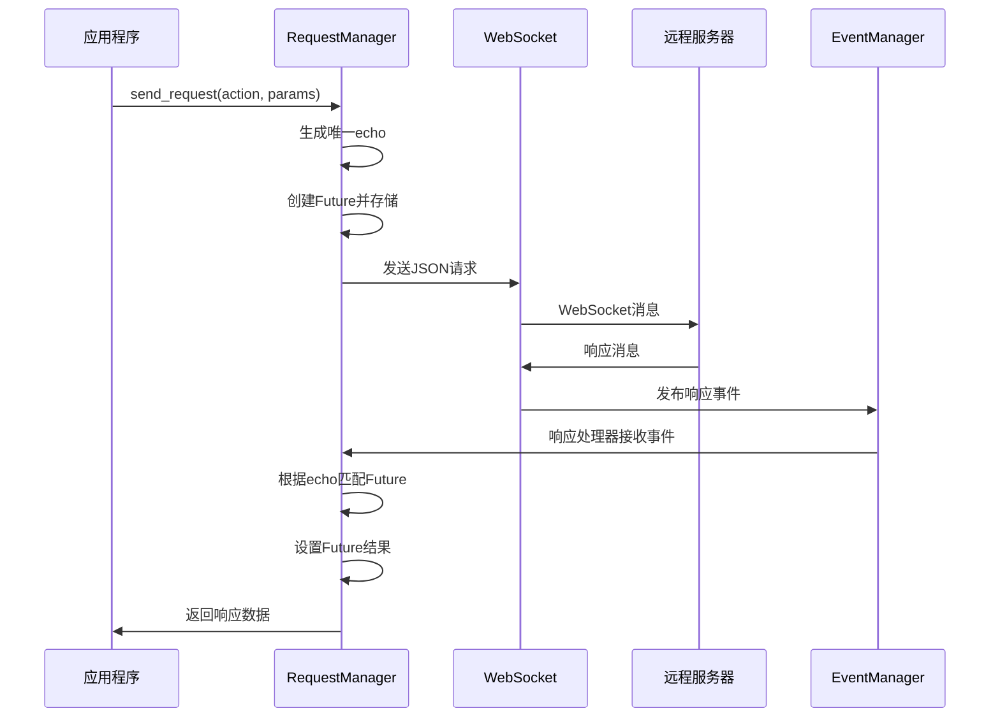

# Helpdesk-beckend
工单系统的后端，向web、安卓app、小程序提供api服务，同时接入onebot v11协议端和llm提供商

## 开发

### 项目结构
```
helpdesk-backend/
├── app/                     # 主应用目录
│   ├── __init__.py
│   ├── main.py             # FastAPI 应用实例和主路由
│   ├── api/                # API 路由目录
│   │   ├── __init__.py
│   │   ├── v1/            # API 版本控制
│   │   │   ├── __init__.py
│   │   │   ├── endpoints/ # 具体接口实现
│   │   │   │   ├── users.py
│   │   │   │   └── items.py
│   │   │   └── dependencies.py
│   ├── core/              # 核心配置
│   │   ├── __init__.py
│   │   ├── config.py      # 配置类
│   │   └── security.py    # 安全相关
│   ├── crud/              # 数据库CRUD操作
│   │   ├── __init__.py
│   │   ├── base.py
│   │   └── crud_user.py
│   ├── db/                # 数据库相关
│   │   ├── __init__.py
│   │   ├── base.py
│   │   └── session.py
│   ├── models/            # SQLAlchemy模型
│   │   ├── __init__.py
│   │   └── user.py
│   └── schemas/           # Pydantic模型
│       ├── __init__.py
│       └── user.py
│
├── tests/                 # 测试目录
│   ├── __init__.py
│   ├── test_api/         # API测试
│   │   └── .gitkeep      # 占位文件
│   └── test_service/     # 服务测试
│       └── .gitkeep      # 占位文件
│
├── alembic/               # 数据库迁移
│   ├── versions/         # 迁移版本文件
│   │   └── .gitkeep     # 占位文件
│   └── env.py
│
├── .env                   # 环境变量配置
├── .gitignore
├── docker-compose.yml     # Docker配置
├── main.py               # 应用入口
├── pyproject.toml        # 项目配置
└── README.md
```

#### 目录说明
- `app/`: 主应用代码
  - `api/`: API路由和接口实现
  - `core/`: 核心配置和安全相关代码
  - `crud/`: 数据库CRUD操作实现
  - `db/`: 数据库配置和会话管理
  - `models/`: SQLAlchemy数据库模型
  - `schemas/`: Pydantic数据验证模型
- `tests/`: 测试代码
  - `test_api/`: API测试（包含.gitkeep占位符）
  - `test_service/`: 服务测试（包含.gitkeep占位符）
- `alembic/`: 数据库迁移文件
  - `versions/`: 迁移版本文件（包含.gitkeep占位符）

### 相关链接

- [Napcat API接口](https://napcat.apifox.cn)
- [SQLAlchemy文档](https://www.sqlalchemy.org)

### 请求管理器架构
